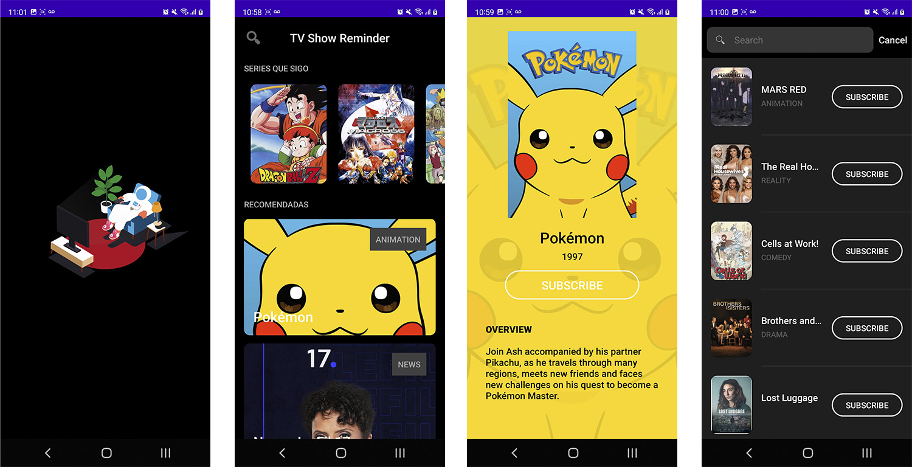

# MoviesDB
Android application using the themoviedb API

## About This Project
This repository contains an Android project using Kotlin, MVVM + Clean Architecture, Dependency injection with Hilt, LiveData, Coroutines, Flow, Retrofit2, ROOM Database, Glide images, Data Binding, Navigation components, Material design, Color Palette, Recyclerview, Collapsing toolbar and Lottie Animations.

## App Features
* Show list of recommended tv shows with genre category
* Search and filter by name
* Save subscription show into internal memory

## App demo 

## Library Used
* [Dependency injection with Hilt](https://developer.android.com/training/dependency-injection/hilt-android)
* [Kotlin flows](https://developer.android.com/kotlin/flow)
* [MVVM Architecture Components](https://developer.android.com/topic/libraries/architecture/)
* [LiveData](https://developer.android.com/topic/libraries/architecture/livedata)
* [View Model](https://developer.android.com/topic/libraries/architecture/viewmodel)
* [Retrofit2](https://square.github.io/retrofit/)
* [ROOM](https://developer.android.com/topic/libraries/architecture/room?gclid=Cj0KCQjwl4v4BRDaARIsAFjATPnKKVVy9yBUiZhCcmGbmLl-6TKUusgYdur0OZq2MOQdsOLN6jXLpvQaAk5mEALw_wcB&gclsrc=aw.ds)
* [Glide](https://bumptech.github.io/glide/)
* [Data Binding](https://developer.android.com/topic/libraries/data-binding)
* [SafeArgs](https://developer.android.com/guide/navigation/navigation-pass-data)
* [Navigation](https://developer.android.com/jetpack/androidx/releases/navigation)
* [Material design](https://material.io/design/)
* [Recyclerview](https://developer.android.com/guide/topics/ui/layout/recyclerview)
* [Coroutines](https://developer.android.com/kotlin/coroutines)
* [Collapsing toolbar](https://material.io/develop/android/components/collapsing-toolbar-layout/)
* [Animations](https://developer.android.com/training/animation/overview)
* [Lottie Animations](https://lottiefiles.com/blog/working-with-lottie/getting-started-with-lottie-animations-in-android-app)
* [Palette](https://developer.android.com/reference/androidx/palette/graphics/Palette)

## Author

**Pablo Vydra** 
* [Linkedin](https://www.linkedin.com/in/pablovydra)
* [Twitter](https://twitter.com/pablovydra?lang=es)
* [Behance](https://www.behance.net/pablovydra)
